# Neural analogy solver

The developed program can be found on EBMT/NLP laboratory local server (itigo) at '/itigo/files/Tools/AnalogySolvers/neural-analogy-solver'

There are three sub-directory inside as:

1. Main programs: at './neural_nlg_solver/*'
2. Tools: at './neural_nlg_tools/*'
3. Experiment scripts: at './experiments/*'
4. Latex styles: at './latex_styles/*'

In the following sections, each part will be described in detail.

---

## AnalogyAlignment

AnalogyAlignment class is the most used objects in our project. Each object contain 2 parts of information. First, the 4 strings (A, B, C, D) and secondly their alignment matrices (AB, AC, DB, DC). Under the hood, formal part is implemented by 'AnalogyEquation' class. Alignment matrices is the list of numpy ndarray objects.

### Initialization ###

To create new AnalogyAlignment object, we need to initialize it with string representing the analogy equation and optionally alignment matrices. The string can be conventional proportional analogy equations or serialized text format (see below).

~~~python
alg_1 = AnalogyAlignment('ama : ora :: amas : oras')
alg_2 = AnalogyAlignment('[a,m,a] : [o,r,a] :: [a,m,a,s] : [o,r,a,s]  [...] [...] [...] [...]')
~~~

### Serialization ###

The objects of this class can be serialize to text and read back into objects as required. Following section describe the serialized format.

For example, we have list of AnalogyAlignment(s)

    [a,m,a] : [o,r,a] :: [a,m,a,s] : [o,r,a,s]  [...] [...] [...] [...]
    [a,m,a] : [o,r,a] :: [a,m,a,s] : [o,r,a,s]  [...] [...] [...] [...]
    ...

Each line represents an AnalogyAlignment object. As you can see two part are clearly seperated. The first (left) part is strings. Symbols (in this case are characters) are written in comma-separated way and surround by bracket [,]. Each symbol can be in any number of characters. Next, left and right part is tab (\t) seperated. *Please be sure that these characters is tab not space. The last past is 4 alignment matrices written in numpy string literal.

Additionally, you can read the analogy in the conventional format as well. For example

    done : over-done :: dressed : over-dressed
    smart : smartest :: long : longest
    conditional : unconditional :: related : unrelated
    community : communities :: economy : economies
    continue : continuation :: customize : customization

During parsing, strings will be split into list of characters. Alignment matrices are not support by this format and will be automatically generated by the character equality points.

### File extensions ###

Two possible file extensions for the serialized form of AnalogyAlignment are:
1. '\*.nlg' to represent raw serialized AnalogyAlignment.
2. '\*.nlg.gz' represent gzipped serialized AnalogyAlignment.
nlg_solver.py use these extension to recognized the input and output file type and choose methods accordingly.

### Methods and properties ###

List of accessible methods and properties of AnalogyAlignment are:

* {}.strs: get list of 4 string. Each string is the list of symbols
* {}.mats: get list of 4 numpy ndarrays as AB, AC, DB and DC
* {}.tex_str: get latex code for the AnalogyAlignment. To be used with 'latex_styles.sty'
* {}.\_\_repr\_\_: get string representation of the AnalogyAlignment object

---

## Main programs

### Install package

The package easily install by python's pip.

1. Required Python>=3.5 and pip
2. Run following command at the root directory (current dir). This will install required packages, refer to setup.py for list.

~~~
pip install .
~~~

* All following content will assume python3 is set as default execution for python command. Otherwise,command 'python3' can be specify.

### Analogy solver (nlg_solver.py)

This is the main program of this project. It solves proportional analogies using neural network models. 

#### Help

List of all adjustable parameters can be obtained by running:

~~~
python nlg_solver.py -h
~~~

##### Required arguments
* -i [INPUT_FILE]: file contains test samples
* -o [OUTPUT_FILE]: file to save prediction results

##### Optional arguments (Model)
* -md, --model_dir [MODEL_DIR]: directory to save trained neural network models (*.h5) and their training logs.
* -c, --config [CONFIG_FILE]: model configuration file (created by nlg_configurator.py)
* --design [single|multi]: neural network design:
    * single: single fixed length model
    * multi: multiple variable length models
* --mode [append|gen|nearest|bilinear|bicubic]: matrix interpolation modes
    * append: naively append with blank spaces
    * nearest: nearest neighbor interpolation
    * bilinear: bilinear interpolation
    * bicubic: bicubic interpolation
    * gen: analogy generation
* --model_dim [-1,1,2,...]: model dimension (for single fixed length model)
* --filter [morph|weight] [[morph|weight]...]: Matrix filtration:
    * morph: mathematical morphology
    * weight: diagonal weighting

##### Optional arguments (Analogy generation)
* --offset [-1,0,1,...]: offset between testing sample string lengths as training to be selected as training sample.
    * Lower number: limit the number of base analogies. Minimum number can also be set to dynamically adjust the offset to compensate (next parameter).
    * -1: disable offset = use all training analogies as generator bases. *This produce huge data aka. likely to crash
* --min_gen [1,2,...]: minimum number of 'generated' analogies
    * Will dynamically increase the offset to achieve higher numbers of generated set than min_gen
    * Unless reach maximum number of generatable training set

##### Optional arguments (Training)
* -tr, --train: file contains training samples
    * In case not set, fallback to default set (see line 57 in nlg_solver.py)
* --shuffle: Shuffle training samples between epochs
* --min_delta [x.x]: early stopping minimum delta, minimum different learning rate between epoch to stop
* --patience [0,1,2,...]: number of epoch with learning rate below min_delta before early stopping

##### Optional arguments (Testing)
* --no_decode: disable string decoding == only predict matrices

##### Optional arguments (Miscellaneous)
* -v, --verbose [0,1,2]: verbose level
    * 0: disable all messages
    * 1: minimum messages
    * 2: all messages

#### Usage examples

1. Minimum example (all default parameters) which will read the analogies from 'test.nlg', solve them and save results to 'solve.nlg':

~~~
python nlg_solver.py -i test.nlg -o solve.nlg
~~~

2. Single fixed length model with dimension of 20, bicubic interpolation

~~~
python nlg_solver.py -i test.nlg -o solve.nlg --design single --model_dim 20 --mode bicubic
~~~

3. Multiple variable length models, analogy generation

~~~
python nlg_solver.py -i test.nlg -o solve.nlg --design multi --mode gen
~~~

***

### Analogy generator (nlg_generator.py)

This is the analogy generator class. It is used by nlg_solver.py when '--mode gen' is used. Though, it also can be execute directly to produce derived analogies from base analogies list.

#### Help

List of all adjustable parameters can be obtained by running:

~~~
python nlg_generator.py -h
~~~

##### Required arguments
* [FILE] [LENGTH]:
    * FILE: path to input file in AnalogyAlignment format (see below)
    * LENGTH: string lengths. Can be either one or four numbers (eg. 4 or 4 5 6 7)
* : file to save prediction results

##### Optional arguments (Output)
* -o, --out [OUTPUT_FILE]: file to save generation results

##### Optional arguments (Generation)
* -vl, --var-length: give all generated variable length analogies as results 
* -m, --methods [METHOD]: 
    * METHOD: sequence of generation methods to run:
        * r: reduplicating
        * p: permuting
        * m: mirroring
        * i: inserting
        * c: casting
    * Default is 'pmric'
    * In some combination, may not produce any results because methods cannot produce specific length analogies. 

##### Optional arguments (Miscellaneous)
* -j, --threads [THREAD_NUM]: number of processing threads. Should never be more than number of physical processor cores.
* -g, --graph: display statistical chart after generation
* -v, --verbose: enable verbose mode

#### Usage examples

1. Generate fix length analogies at string length |A|=|B|=|C|=|D|=10 with all generation methods:

~~~
python nlg_generator.py source.nlg 7
~~~

~~~
[a,>,>,>,>,>,>] : [<,<,b,>,>,>,>] :: [<,a,>,>,>,>,>] : [<,<,<,b,>,>,>]
[<,b,2,b,>,>,>] : [<,a,2,a,>,>,>] :: [<,<,b,2,b,>,>] : [<,<,a,2,a,>,>]
[b,3,b,>,>,>,>] : [<,<,<,<,b,3,b] :: [a,3,a,>,>,>,>] : [<,<,<,<,a,3,a]
...
~~~

2. Fix length non uniform analogies

~~~
python nlg_generator.py source.nlg 7 9 2 4
~~~

~~~
[<,a,>,>,>,>,>] : [<,a,>,>,>,>,>,>,>] :: [a,>] : [a,>,>,>]
[<,a,a,>,>,>,>] : [<,a,a,>,>,>,>,>,>] :: [a,a] : [a,a,>,>]
[<,<,<,a,a,>,>] : [<,<,<,<,<,a,a,>,>] :: [b,b] : [<,<,b,b]
...
~~~

3. Variable length analogies

~~~
python nlg_generator.py source.nlg 5 -vl
~~~

~~~
[<,a,0,a] : [<,b,0,b,>] :: [a,0,a] : [b,0,b,>]
[<,a] : [<,<,<,b] :: [<,<,a] : [<,<,<,<,b]
[b,0,b] : [<,b,0,b] :: [<,a,0,a] : [<,<,a,0,a]
...
~~~

4. Specific generation methods

~~~
python nlg_generator.py source.nlg 7 -m 'c'
~~~

~~~
[<,<,<,<,<,<,a] : [<,<,<,<,<,<,a] :: [<,<,<,<,<,a,>] : [<,<,<,<,<,a,>]
[<,a,>,>,>,>,>] : [<,<,a,>,>,>,>] :: [a,>,>,>,>,>,>] : [<,a,>,>,>,>,>]
[a,>,>,>,>,>,>] : [<,<,<,<,a,>,>] :: [a,>,>,>,>,>,>] : [<,<,<,<,a,>,>]
...
~~~

5. Save to file

~~~
python nlg_generator.py source.nlg 7 -o generated.nlg
~~~

***

## Tools

Few very convenient tools are developed for this project. The list of tools are:

1. nlg_configurator.py: Modify the neural network configuration and save as file to be load by nlg_solver.py.

2. nlg_viewer.py: Previewer for AnalogyAlignment files (*.nlg, *.nlg.gz).

Next, the instruction for these tools are shown.

### Neural network configurator (nlg_configurator.py)

This tool can create or modify model configuration for neural analogy solver

* Start configurator by go to directory 'neural_nlg_tools' and run 'nlg_configurator.py'.

~~~
cd neural_nlg_tools
python nlg_configurator.py
~~~

* Interface of the configurator

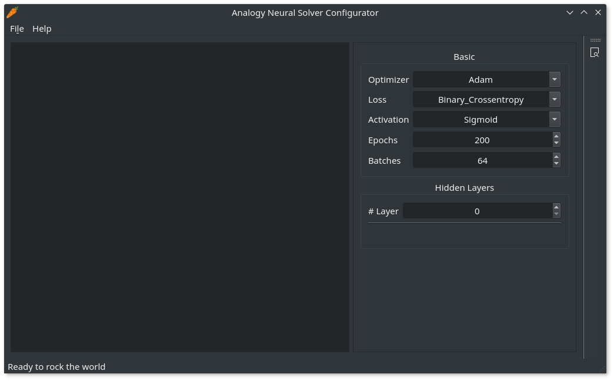

* You can create, open and save the configurations

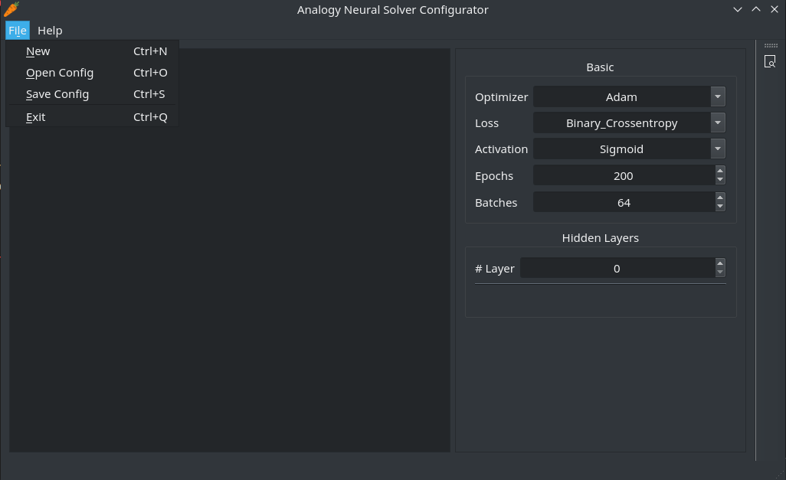

* You can compile and preview the model layers by press 'Ctrl+b' or click the 'Preview' button on right toolbar.

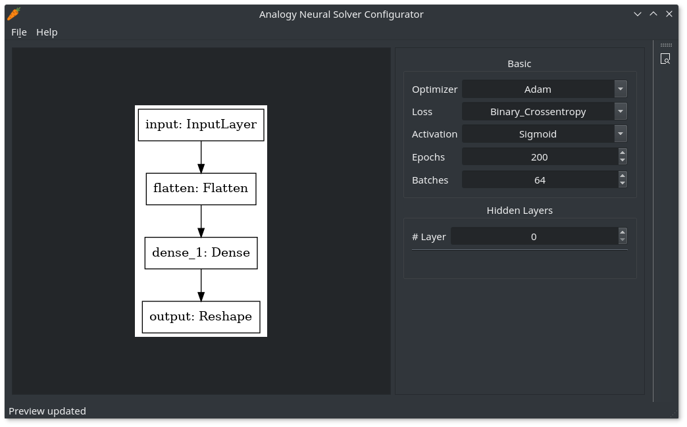

* List of available optimizers, losses and activations

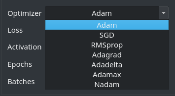

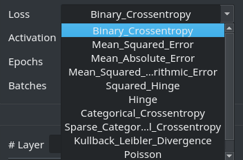

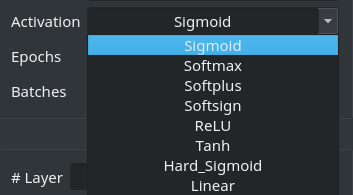

* Hidden layer settings

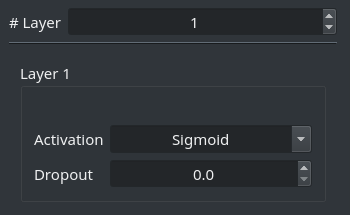

### Analogy alignment viewer (nlg_viewer.py)

* Interface of the viewer.

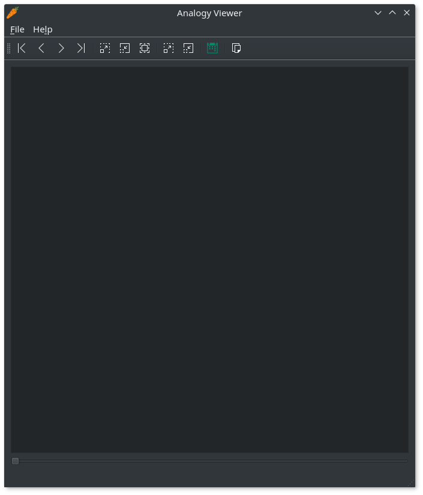

* Load in the analogies.

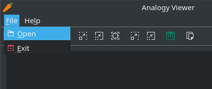

* Allow file extensions are '\*.nlg' and '\*.nlg.gz'.

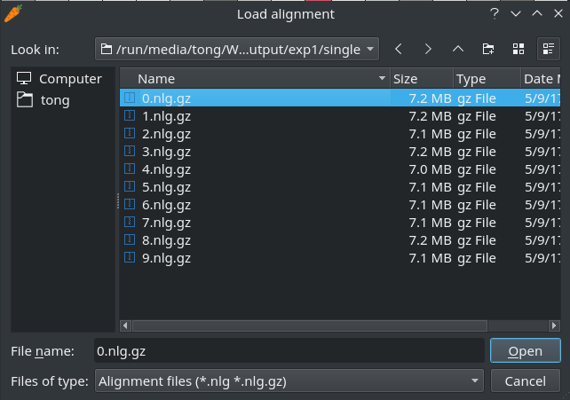

* A preview of alignment prediction from neural network.

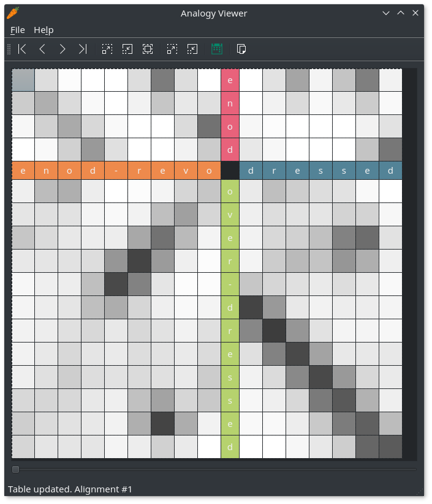

* Viewer can also load test set which do not contains string D.

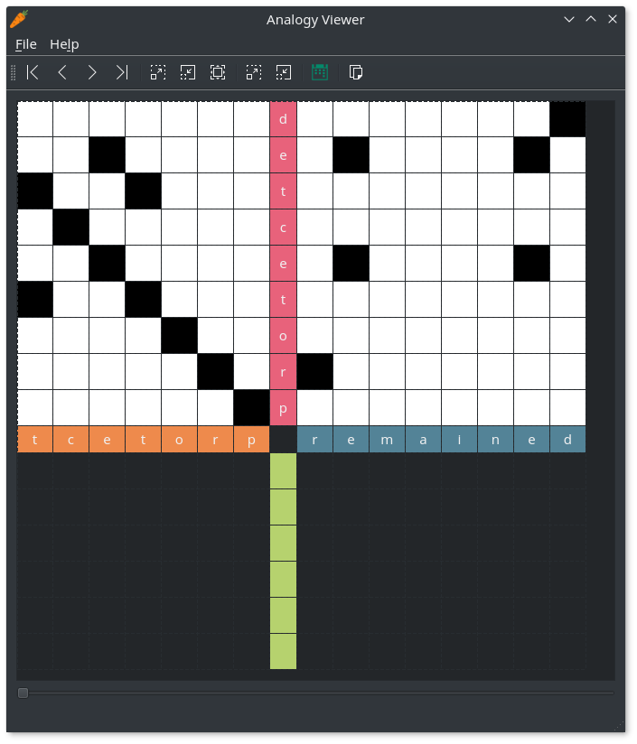

* Move slider to change between analogies in the file.

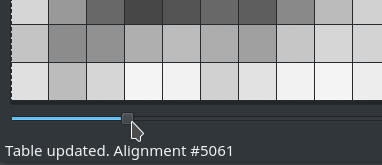

* Let look at the top toolbar.

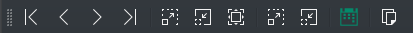

The list of tool (from left to right) are:

    1. First: go to first
    2. Previous: go back once
    3. Next: go forward once
    4. Last: go to last
    5. Zoom in
    6. Zoom out
    7. Best fit: scale the preview to fit in current window size
    8. Enlarge text cells
    9. Contract text cells
    10. Show equal points (See below)
    11. Copy Tikz (latex) code (See below)

* Click on 'Show equal point' button (Green icon) will highlight the equality points:

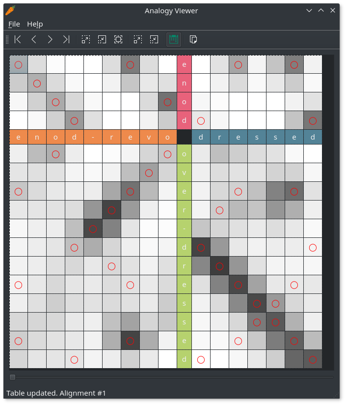

* Click on the last tool will copy the Tikz (latex) code to clipboard

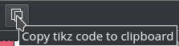

* Used together with the latex style 'alignmat.sty', it produces:

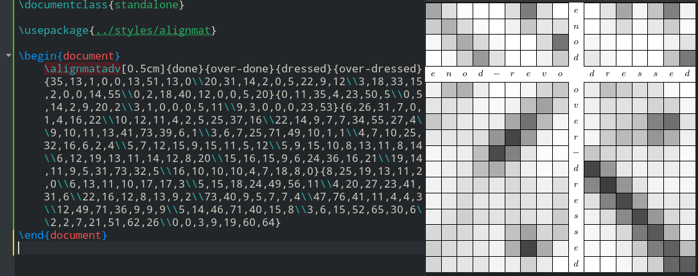

* It also works with the file which has no alignment data.

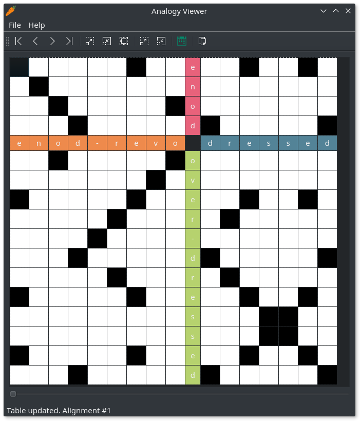

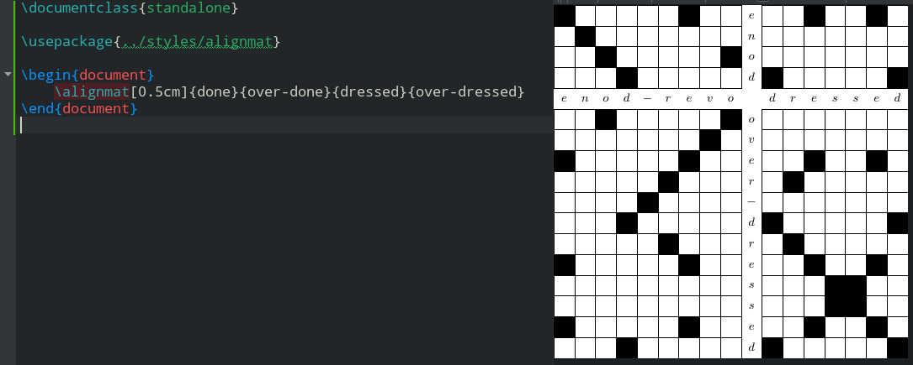

***

## Experiments

All experiments shown in my thesis (Kaveeta) can be found in directory 'experiments'. The require data are already set up into their own directories (config, input, ...)

To run the experiment, you need to
1. Install the package (please refer to above 'Install package' section )
2. Edit all_experiment.py to comment out unwanted experiments *WARNING perform all experiments can take very long time (weeks).
3. Run script:

~~~
cd experiments
python all_experiments.py
~~~
